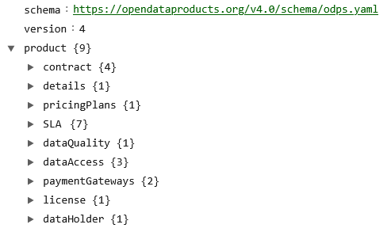

# OPEN DATA PRODUCT SPECIFICATION 

## 4.0 Release Candidate Version 

The key words “MUST”, “MUST NOT”, “REQUIRED”, “SHALL”, “SHALL NOT”, “SHOULD”, “SHOULD NOT”, “RECOMMENDED”, “NOT RECOMMENDED”, “MAY”, and “OPTIONAL” in this document are to be interpreted as described in BCP 14 [RFC2119] [RFC8174] when, and only when, they appear in all capitals, as shown here.

The specification is shared under <a href='https://www.apache.org/licenses/LICENSE-2.0'>Apache 2.0</a> license. 
Development of the specification is under the umbrella of the Linux Foundation. 

**RELEASE CANDIDATE VERSION**


**Version source:**

* <a href="https://github.com/Open-Data-Product-Initiative/4rc">https://github.com/Open-Data-Product-Initiative/4rc</a>

**ODPS YAML Schema:**

* <a href="https://opendataproducts.org/v4.0/schema/odps.yaml">YAML Schema</a>

**Editors:**

* <a href="https://www.linkedin.com/in/jarkkomoilanen/">Jarkko Moilanen</a>
* <a href="https://www.linkedin.com/in/manfred-sorg/">Manfred Sorg</a>

**Participate:**

* [Raise an issue in Github](https://github.com/Open-Data-Product-Initiative/4rc/issues)


## HowTo - ODPS Knowledge Base

The odps‑examples repository serves as a comprehensive knowledge base for using the Open Data Product Specification (ODPS), combining clear FAQs with real-world YAML examples to guide users through practical implementation. Each FAQ entry tackles a specific task—like defining metadata, setting pricing tiers, assigning SLAs, configuring data quality rules, managing access roles, or enabling AI/agent consumption—accompanied by executable YAML snippets and full .yml files. 

The content is modular, code‑first, and designed for easy reuse, enabling teams to discover, govern, monetize, validate, and automate data products using standardized, machine-readable metadata. Users are encouraged to contribute new scenarios or enhancements via GitHub issues.

[Knowledge Base in Github](https://opendataproducts.org/howto/). 

## Introduction

The Open Data Product Specification is a vendor-neutral, open-source machine-readable data product metadata model. It defines the objects and attributes as well as the structure of digital data products. The work is based on existing standards (schema.org), best practices and emerging concepts like Data Mesh. The reasoning is that we reuse and proudly copy instead of reinventing the wheel. More detailed information of the origin can be found from the [Open Data Product Specification homepage](http://www.opendataproducts.org). 

**The ODPS 4.0 specification supports referencing mechanisms** that improve modularity, reduce duplication, and ease governance. Users can reference internal components, such as SLA, dataQuality, dataAccess, and paymentGateways, from other parts of the product definition using JSON Reference syntax ($ref). In addition, any of these components can be defined and maintained in external YAML files and included via URL-based references. This makes it possible to reuse standardized SLA profiles, DQ rules, or access definitions across multiple data products, helping teams manage changes consistently, reduce errors, and align with enterprise-level governance practices.

You can reference **Data Contract as a URL or define Data Contract as an inline element** in ODPS. Both Data Contract Specification (DCS) and Open Data Contract Standard (ODCS) supported. 

## Specification aims and aspects

**Specification aims:**

* enable interoperability between organizations, data platforms,  marketplaces, and tools. 
* reduce data product metadata conversions and errors between systems and organizations, 
* increase the speed of designing, testing, and implementing data products. 
* speed up tools development around data product design, development and management.
* enable creation of automated data product deployment with standard methods (DataOps)
* support flexible data product pricing with plans specific DQ, SLA, and Access (with references)
* enable [Everything as Code](https://www.cloudbees.com/blog/what-is-everything-as-code-eac) approach for SLA and Data Quality monitoring

**Note!** In the "Open Data Product" focus is on the latter words and the prefix  'open' refers to the openness of the standard. Any kind of connotations to open data (a different thing) are not intentional, intended, or desirable.

The specification has been designed with four major aspects of the data product in mind: 1) technical (infrastructure & access), 2) business (pricing & plans), 3) legal (licensing & IPR), and 4) ethical (privacy & mydata). The four aspects are described in 9 objects, which contain attributes and elements. 




If you see something missing, described inaccurately or plain wrong, or you want to comment the specification, [raise an issue in Github](https://github.com/Open-Data-Product-Initiative/rc4/issues)

## Document structure

**LEFT COLUMN: Navigation**

The left column is navigation which enables fluent and easy movement around the specification. 

**MIDDLE COLUMN: Principles and components**

The middle column contains detailed information about the included components and related options. This is the theory part. 

Note! Mandatory elements and attributes are listed separately in the definition tables. This enables user to construct minimum viable specification more easily and fast. https://schema.org provided ready-made definitions are applied when ever possible instead of re-inventing the wheel. 

**RIGHT COLUMN: Examples**

The right column contains YAML formatted examples of how the specification is used. In the future other output formats are added on request basis. YAML can easily be converted to JSON if needed. 

> Example of YAML formatted snippet from the Open Data Product Specification:

```yml
dataQuality:
  declarative:
    - dimension: accuracy
      displaytitle:
      - en: Data Accuracy (percent)
```


# Document level attributes

Here's the list of attributes which can occur at the document root level. In the following description, if a field is not explicitly **REQUIRED** or described with a MUST or SHALL, it can be considered OPTIONAL. Optional attributes are listed in own table and examples are given on the right column. 

It is RECOMMENDED that the root OpenAPI document be named: dataproduct.json or dataproduct.yaml.

## Mandatory attributes

> Example of document level attribute usage and structure:

```yml
schema: https://opendataproducts.org/v4.0/schema/odps.yaml
version: 4.0
product:
  details:
    en:
      name: Pets of the year
      productID: 123456are
      visibility: private
      status: draft
      type: dataset
    fi:
      name: Vuoden suosituimmat lemmikit
      productID: 123456are
      visibility: private
      status: draft
      type: dataset
```

| <div style="width:150px">Element name</div>   | Type  | Options  | Description  |
|---|---|---|---|
| **schema** | URL | Valid URL. See more from [RFC 3986](https://datatracker.ietf.org/doc/html/rfc3986). | **REQUIRED** Defines the URL of Schema. Used often for validation purposes. |
| **version** | string | This is the version of ODPS, for example dev or 2.2 | **REQUIRED** Defines the ODPS version. |
| **product** | element | root element | **REQUIRED** Root element to tie all together. |


## Optional attributes

RecommendedDataProducts **OBJECT** contains an array of data products which offers means to attach related data products to the data product at hand. The source of the recommended data product might be from the same marketplace/catalog or an external one. Recommended object offers method to extend the reach and promotion escpecially when data product is treated as an independent entity much like described in Data Mesh. Also when data product is published in a marketplace, the Recommended object offers means to promote other than just the data products from the given data marketplace. In short, tis object is mainly for discovery and reach purposes. 

RecommendedUseCases **OBJECT** is an array which contains offers method to attach usefull usecases to the data product. Usecases are informatiove for the the data customer and exemplify how the data product can create value. 

> Example of document level attribute usage and structure:

```yml
schema: https://opendataproducts.org/v4.0/schema/odps.yaml
version: 4.0
product:
  contract:
    id: 02323M123  
    type:  ODCS 
    contractVersion:  2.2.2
    contractURL: https://demo.datamesh-manager.com/demo834016807886/dataproducts/9bd53b1b-b51e-41a8-a757-4d33b4cde460
  details: 
    en:
      name: Pets of the year
      productID: 123456are
      valueProposition: Design a customised petstore using a data product that describes
        pets with their habits, preferences and characteristics.
      description: This is an example of a Petstore product.
      productSeries: Lovely pets data products
      visibility: private
      status: draft
      productVersion: '0.1.0'
      versionNotes: New version with additional details such more accurate pet details
      issues: The current issues include incorrect information in the dog breeds. The
        resolution for these problems is planned for the next     update, scheduled
        to be released on July 15th, 2023.
      categories:
      - pets
      standards:
      - ISO 24631-6
      tags:
      - pet
      brandSlogan: Passion for the data monetization
      type: dataset
      contentSample: https://download.com/pets.json
      logoURL: https://data-product-business.github.io/open-data-product-spec/images/logo-dps-ebd5a97d.png
      OutputFileFormats:
      - JSON
      - XML
      - CSV
      - ZIP
      - PDF
      useCases:
      - useCase:
          useCaseTitle: Build attractive and lucrative petstore!
          useCaseDescription: Use case description how succesfull petstore chain was established in Abu Dhabi
          useCaseURL: https://marketplace.com/usecase1
      recommendedDataProducts:
      - https://marketplace.com/dataproduct.json
      - https://marketplace.com/dataproduct-another.json

```

| <div style="width:150px">Element name</div>   | Type  | Options  | Description  |
|---|---|---|---|
| **created**  | date | Use [ISO 8601](https://en.wikipedia.org/wiki/ISO_8601) | When product was created. | 
| **updated**  | date | Use [ISO 8601](https://en.wikipedia.org/wiki/ISO_8601) | When product was last updated. |
| **valueProposition** | string  | text content, max length 512 chars  | This is the product's value proposition. Often one or two sentences and crystallizes the value for the customer. |
| **description** | string | - | The description of the product. Text only. |
| **productSeries** | string | - | A group of products in the product mix which are associated with each other and they can be obtained for the same type of customers or they are marketable for the same type of market place. |
| **categories** | array | - | Comma separated array of categories. |
| **standards** | array | - | Comma separated array of standards related e.g. to data content or quality, such as ISO 8000 or ISO 19131. |
| **tags** | array | - | Comma separates array of tags. |
| **productVersion** | string | The versioning according to [SemVer](https://semver.org/) | The version of the data product. Applies for ODPS metadata as well. |
| **versionNotes** | string | - | Additional information about the version. |
| **issues** | string | - |  There may be errors in the data product that require corrections. These issues will be briefly described to users, along with information about when the fixes will be implemented.|
| **contentSample** | URL | Valid URL. See more from [RFC 3986](https://datatracker.ietf.org/doc/html/rfc3986). | Sample content of the data product, for example JSON/XML output. This sample should match the actual data product output and give the data consumer an idea what to expect. Obviously if the data product is pure service for example dashboard or algorithm, then consider providing preview version or alike |
| **logoURL** | URL | Valid URL | Valid URL of the logo. See more from [RFC 3986](https://datatracker.ietf.org/doc/html/rfc3986). |
| **outputFileFormats** | string | - | Output file formats for data product |
| **brandSlogan** | string | - | Brand related slogan like Nike has *just do it*. |
| **useCases** | element | array | Contains list of related use cases with description information and link to details. **NOTE!** These examples are expected to use same language as defined previously in the data product details content binding element. |
| **useCaseTitle**| string | string | Title of the usecase. |
| **useCaseDescription** | string | - | Brief description of the usecase. |
| **useCaseURL**| URL | Valid URL, [RFC 3986](https://datatracker.ietf.org/doc/html/rfc3986) | Valid URL of the more detailed usecase description. |
| **recommendedDataProducts** | array | Array of valid URLs ([RFC 3986](https://datatracker.ietf.org/doc/html/rfc3986)) | Data products to recommend use next to this data product or even as replacement (for comparison). The URL provided MUST reference a description of a data product following this same standard |

If you see something missing, described inaccurately or plain wrong, or you want to comment the specification, [raise an issue in Github](https://github.com/Open-Data-Product-Initiative/dev/issues)
